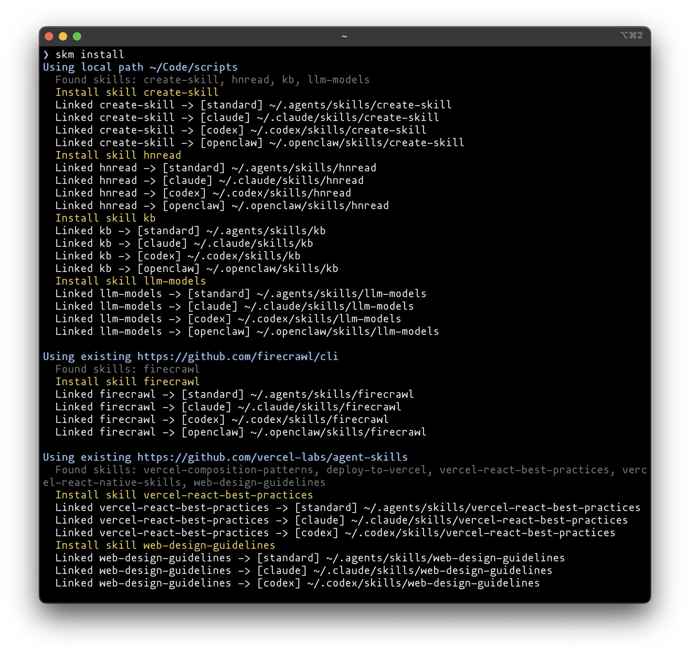

# SKM - Skill Manager

A CLI tool that manages **global** AI agent skills from GitHub repos or local directories. Clone repos or link local paths, detect skills via `SKILL.md`, and install them into agent directories — all driven by a single YAML config.

> **Note:** skm manages skills at the user level (e.g. `~/.claude/skills/`), not at the project level. It is not intended for installing skills into project-scoped directories.



## Install

```bash
uv tool install skm-cli
```

Or install from source:

```bash
uv tool install git+https://github.com/reorx/skm
```

## Quick Start

1. Create `~/.config/skm/skills.yaml`:

```yaml
packages:
  - repo: https://github.com/vercel-labs/agent-skills
    skills:
      - vercel-react-best-practices
      - vercel-react-native-skills
  - repo: https://github.com/blader/humanizer
  - local_path: ~/Code/my-custom-skills       # use a local directory instead of a git repo
```

2. Run install (`skm i` for short):

```bash
skm install
```

Skills are cloned (or symlinked from local paths) into your agent directories (`~/.claude/skills/`, `~/.codex/skills/`, etc.).
Most agents use symlinks; `standard` and `openclaw` use materialized installs.

### Install from a source directly

You can also install skills directly from a repo URL or local path — no need to edit `skills.yaml` first:

```bash
# Install from a GitHub repo (interactive skill & agent selection)
skm install https://github.com/vercel-labs/agent-skills

# Install a specific skill by name
skm install https://github.com/vercel-labs/agent-skills vercel-react-best-practices

# Install from a local directory
skm install ~/Code/my-custom-skills

# Skip interactive prompts with --agents-includes / --agents-excludes
skm install https://github.com/blader/humanizer --agents-includes claude,codex
```

This detects available skills, lets you pick which ones to install (unless a specific skill name is given), and automatically adds the package to your `skills.yaml` config.

## Commands

| Command | Description |
|---|---|
| `skm install` (or `skm i`) | Install all packages from config. Clone repos (or link local paths), detect skills, install to agents, write lock file. Idempotent — also removes stale links (see below). |
| `skm install <source> [skill]` (or `skm i`) | Install directly from a repo URL or local path without editing config. Interactively select skills and agents, then auto-update config. |
| `skm list` | Show installed skills and their linked paths. |
| `skm list --all` | Show all skills across all agent directories, marking which are managed by skm. |
| `skm view <source>` | Browse and preview skills from a repo URL or local path without installing. |
| `skm edit` | Open `skills.yaml` in `$EDITOR` (falls back to system default). Shows diff after editing. |
| `skm check-updates` | Fetch remotes and show available updates (skips `local_path` packages). |
| `skm update <skill>` | Pull latest for a skill's repo, re-detect, re-link, update lock (skips `local_path` packages). |

## Config Format

`~/.config/skm/skills.yaml`:

```yaml
agents:
  default:                   # optional: select which agents are active (omit = all)
    - claude
    - standard
  override:                  # optional: override built-in agent path or install mode
    codex:
      path: ~/.custom-codex/skills

packages:
  - repo: https://github.com/vercel-labs/agent-skills
    skills:                  # optional: install only these skills (omit = all)
      - vercel-react-best-practices
    agents:                  # optional: further filter agents for this package
      excludes:
        - standard

  - repo: https://github.com/blader/humanizer   # installs all detected skills to default agents

  - local_path: ~/Code/my-custom-skills         # use a local directory as package source
    skills:
      - my-skill
```

Each package must specify exactly one of `repo` or `local_path`. Local path packages use the directory directly (no cloning) and are skipped by `check-updates` and `update`.

## Install Sync Behavior

`skm install` treats `skills.yaml` as a declarative state file. Each run syncs the agent directories to match the config:

- **New skills** are linked to agent directories.
- **Removed skills** (dropped from a package's `skills:` list, or entire package removed) have their links deleted.
- **Agent config changes** (e.g. adding `excludes: [openclaw]`) remove links from excluded agents while keeping links in others.

Only links tracked in `skills-lock.yaml` are affected. Manually created files or skills installed by other tools in agent directories are never touched.

## Skill Detection

A skill is a directory containing a `SKILL.md` file with YAML frontmatter (`name` field required). Detection order:

1. Root `SKILL.md` — the repo itself is a singleton skill
2. `./skills/` subdirectory exists — scan its children
3. Otherwise — walk all subdirectories from repo root
4. Stop descending once `SKILL.md` is found (no nested skills)

## Known Agents

Skills are installed into these directories by default:

| Agent | Path |
|---|---|
| `standard` | `~/.agents/skills/` |
| `claude` | `~/.claude/skills/` |
| `codex` | `~/.codex/skills/` |
| `openclaw` | `~/.openclaw/skills/` |
| `pi` | `~/.pi/agent/skills/` |

`standard` and `openclaw` use materialized installs instead of symlinks. These built-in defaults are defined in code.

## Copy Strategy

When skm installs a skill into an agent directory, it picks a strategy based on the agent spec and filesystem:

### 1. Symlink (default)

A symbolic link from `<agent_dir>/skills/<skill_name>` → `<store>/<skill_name>`. This is the default for all agents. Changes in the store are immediately visible.

### 2. Materialize

When an agent uses `install_mode: materialize`, skm creates a real directory instead of a symlink. On the same filesystem/device it uses hardlinks, so each file in the installed skill directory points to the same inode as the source.

### 3. Reflink (copy-on-write)

When a materialized install cannot use hardlinks because source and target are on **different devices**, skm attempts a reflink/COW clone. This creates an independent copy that shares physical disk blocks with the source until either side is modified — fast and space-efficient.

The reflink backend is platform-specific:

| Platform | Mechanism | Supported filesystems |
|---|---|---|
| **Linux** | `FICLONE` ioctl (`fcntl.ioctl`) | Btrfs, XFS, OCFS2, and others with reflink support |
| **macOS** | `clonefile(2)` syscall (via `ctypes`) | APFS (default since macOS 10.13) |

### 4. Plain copy (fallback)

If reflink is not available for a materialized install (unsupported filesystem, non-Unix platform, etc.), skm falls back to a plain `shutil.copy2` — a full byte copy with metadata preserved.

### Selection flow

```
install_mode == symlink?
├── Yes → symlink
└── No  → same device?
    ├── Yes → hardlink
    └── No  → reflink supported?
        ├── Yes → reflink (COW clone)
        └── No  → plain copy
```

The reflink implementation is isolated in `src/skm/clonefile.py` with dedicated tests in `tests/test_clonefile.py`.

## CLI Path Overrides

Override default paths for testing or custom setups:

```bash
skm --config /tmp/test.yaml \
    --store /tmp/store \
    --lock /tmp/lock.yaml \
    --agents-dir /tmp/agents \
    install
```

## Key Paths

- **Config:** `~/.config/skm/skills.yaml`
- **Lock:** `~/.config/skm/skills-lock.yaml`
- **Store:** `~/.local/share/skm/skills/`

## Development

```bash
uv sync
uv run pytest -v      # run tests
uv run skm --help     # run CLI
```
