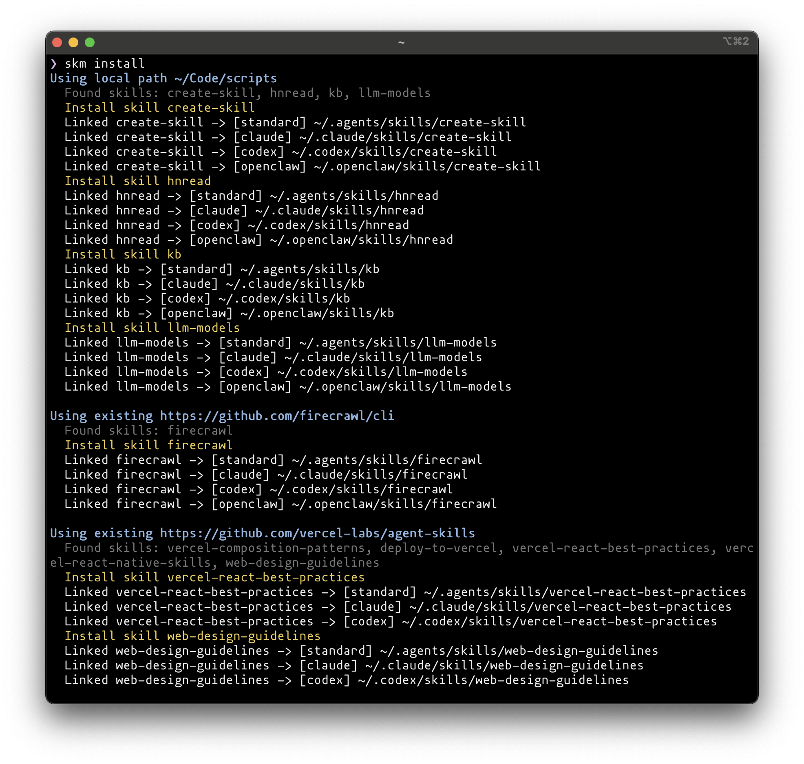

# SKM - Skill Manager

A CLI tool that manages **global** AI agent skills from GitHub repos or local directories. Clone repos or link local paths, detect skills via `SKILL.md`, and symlink them into agent directories — all driven by a single YAML config.

> **Note:** skm manages skills at the user level (e.g. `~/.claude/skills/`), not at the project level. It is not intended for installing skills into project-scoped directories.



## Install

```bash
uv tool install skm-cli
```

Or install from source:

```bash
uv tool install git+https://github.com/reorx/skm
```

## Quick Start

1. Create `~/.config/skm/skills.yaml`:

```yaml
packages:
  - repo: https://github.com/vercel-labs/agent-skills
    skills:
      - vercel-react-best-practices
      - vercel-react-native-skills
  - repo: https://github.com/blader/humanizer
  - local_path: ~/Code/my-custom-skills       # use a local directory instead of a git repo
```

2. Run install (`skm i` for short):

```bash
skm install
```

Skills are cloned (or symlinked from local paths) into your agent directories (`~/.claude/skills/`, `~/.codex/skills/`, etc.).

### Install from a source directly

You can also install skills directly from a repo URL or local path — no need to edit `skills.yaml` first:

```bash
# Install from a GitHub repo (interactive skill & agent selection)
skm install https://github.com/vercel-labs/agent-skills

# Install a specific skill by name
skm install https://github.com/vercel-labs/agent-skills vercel-react-best-practices

# Install from a local directory
skm install ~/Code/my-custom-skills

# Skip interactive prompts with --agents-includes / --agents-excludes
skm install https://github.com/blader/humanizer --agents-includes claude,codex
```

This detects available skills, lets you pick which ones to install (unless a specific skill name is given), and automatically adds the package to your `skills.yaml` config.

## Commands

| Command | Description |
|---|---|
| `skm install` (or `skm i`) | Install all packages from config. Clone repos (or link local paths), detect skills, symlink to agents, write lock file. Idempotent — also removes stale links (see below). |
| `skm install <source> [skill]` (or `skm i`) | Install directly from a repo URL or local path without editing config. Interactively select skills and agents, then auto-update config. |
| `skm list` | Show installed skills and their linked paths. |
| `skm list --all` | Show all skills across all agent directories, marking which are managed by skm. |
| `skm view <source>` | Browse and preview skills from a repo URL or local path without installing. |
| `skm edit` | Open `skills.yaml` in `$EDITOR` (falls back to system default). Shows diff after editing. |
| `skm check-updates` | Fetch remotes and show available updates (skips `local_path` packages). |
| `skm update <skill>` | Pull latest for a skill's repo, re-detect, re-link, update lock (skips `local_path` packages). |

## Config Format

`~/.config/skm/skills.yaml`:

```yaml
agents:
  default:                   # optional: select which agents are active (omit = all)
    - claude
    - standard

packages:
  - repo: https://github.com/vercel-labs/agent-skills
    clone_strategy: shallow       # optional: use git clone --filter=blob:none --depth 1
    skills_dir: skills/.curated   # optional: search only this repo-relative directory
    skills:                  # optional: install only these skills (omit = all)
      - vercel-react-best-practices
    agents:                  # optional: further filter agents for this package
      excludes:
        - standard

  - repo: https://github.com/blader/humanizer   # installs all detected skills to default agents

  - local_path: ~/Code/my-custom-skills         # use a local directory as package source
    skills:
      - my-skill

  - local_path: ~/Code/devblocks
    skills_excludes:         # optional: install all skills EXCEPT these (mutually exclusive with skills)
      - team-squad
      - team-council
```

Each package must specify exactly one of `repo` or `local_path`. Local path packages use the directory directly (no cloning) and are skipped by `check-updates` and `update`.

Repo packages are cloned with a sparse checkout: skm runs `git clone --filter=blob:none --no-checkout`, lists the tree with `git ls-tree`, and checks out only the directories that contain a `SKILL.md` (using the same detection rules as below, honoring `skills_dir`). A large monorepo that ships a couple of skills therefore costs a few hundred KB on disk instead of the whole working tree. The store stays a normal git repo, so `check-updates` and `update` work unchanged; the sparse set is recomputed after every pull so skills added upstream are picked up automatically. Repos whose root is itself a skill are checked out in full.

`clone_strategy: shallow` is optional for repo packages. When set, the first clone additionally passes `--depth 1`; omitted or other values keep the full history (blobs are still fetched lazily). Existing cached repos are reused and pulled, so changing this option does not re-clone an already-present repo. Caches created before sparse checkout was introduced shrink on their next `skm update`.

`skills_dir` is optional and must be a relative path inside the package. When set, skm searches only that directory for `SKILL.md` files instead of using the default detection order.

`skills` and `skills_excludes` are mutually exclusive. `skills` installs only the listed skills; `skills_excludes` installs all detected skills except the listed ones. Omitting both installs all detected skills.

## Install Sync Behavior

`skm install` treats `skills.yaml` as a declarative state file. Each run syncs the agent directories to match the config:

- **New skills** are linked to agent directories.
- **Removed skills** (dropped from a package's `skills:` list, or entire package removed) have their links deleted.
- **Agent config changes** (e.g. adding `excludes: [openclaw]`) remove links from excluded agents while keeping links in others.

Only links tracked in `skills-lock.yaml` are affected. Manually created files or skills installed by other tools in agent directories are never touched.

## Skill Detection

A skill is a directory containing a `SKILL.md` file with YAML frontmatter (`name` field required). Detection order:

1. Root `SKILL.md` — the repo itself is a singleton skill
2. `./skills/` subdirectory exists — scan its children
3. Otherwise — walk all subdirectories from repo root
4. Stop descending once `SKILL.md` is found (no nested skills)

If a package sets `skills_dir`, this default order is bypassed and only that directory is scanned. If `skills_dir` itself contains `SKILL.md`, it is treated as a singleton skill.

## Known Agents

Skills are symlinked into these directories by default:

| Agent | Path |
|---|---|
| `standard` | `~/.agents/skills/` |
| `claude` | `~/.claude/skills/` |
| `codex` | `~/.codex/skills/` |
| `openclaw` | `~/.openclaw/skills/` |

## Copy Strategy

When skm links a skill into an agent directory, it picks a strategy based on the agent config and filesystem:

### 1. Symlink (default)

A symbolic link from `<agent_dir>/skills/<skill_name>` → `<store>/<skill_name>`. This is the default for all agents. Changes in the store are immediately visible.

### 2. Hardlink

When `use_hardlink: true` is set for an agent in `AGENT_OPTIONS`, skm creates hardlinks instead. Each file in the skill directory gets its own hardlink pointing to the same inode as the source. This only works when source and target are on the **same filesystem/device**.

### 3. Reflink (copy-on-write)

When hardlinks can't be used (source and target on **different devices**), skm attempts a reflink/COW clone. This creates an independent copy that shares physical disk blocks with the source until either side is modified — fast and space-efficient.

The reflink backend is platform-specific:

| Platform | Mechanism | Supported filesystems |
|---|---|---|
| **Linux** | `FICLONE` ioctl (`fcntl.ioctl`) | Btrfs, XFS, OCFS2, and others with reflink support |
| **macOS** | `clonefile(2)` syscall (via `ctypes`) | APFS (default since macOS 10.13) |

### 4. Plain copy (fallback)

If reflink is not available (unsupported filesystem, non-Unix platform, etc.), skm falls back to a plain `shutil.copy2` — a full byte copy with metadata preserved.

### Selection flow

```
use_hardlink enabled?
├── No  → symlink
└── Yes → same device?
    ├── Yes → hardlink
    └── No  → reflink supported?
        ├── Yes → reflink (COW clone)
        └── No  → plain copy
```

The reflink implementation is isolated in `src/skm/clonefile.py` with dedicated tests in `tests/test_clonefile.py`.

## CLI Path Overrides

Override default paths for testing or custom setups:

```bash
skm --config /tmp/test.yaml \
    --store /tmp/store \
    --lock /tmp/lock.yaml \
    --agents-dir /tmp/agents \
    install
```

## Key Paths

- **Config:** `~/.config/skm/skills.yaml`
- **Lock:** `~/.config/skm/skills-lock.yaml`
- **Store:** `~/.local/share/skm/skills/`

## Development

```bash
uv sync
uv run pytest -v      # run tests
uv run skm --help     # run CLI
```
